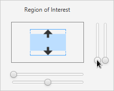

# LaneAssist_OpenCV
This repository contains the school project due for the _Computer Vision_ class at Politecnico di Torino, Master of Science in Computer Engineering.

The project required the development of a OpenCV-Java application for detecting lane departure in provided videos.  
The graphical user interface has been developed with JavaFX and has been intended for allowing the tuning of the lane detection algorithm in order to have it work on any video.
In fact, the way the algorithm operates depends on many parameters, such as the video resolution, the dashcam's angle of view, the environment light, etc.

  
The rightmost part of the interface shows all the tunable parameters, divided by category.

The most important one is the Region of Interest (ROI), which is represented by the light blue rectangle in the right panel and by the split white rectangle shown on the video.
The four sliders in the panel help the user adjust the position and the size of the region of interest, in order to have it match the size of a lane.  

 |  |  |   
:------------------------------------: | :-------------------------------------: | :-------------------------------------: | :------------------------------------:
Increase/decrease ROI height           | Move ROI up/down                        | Increase/decrease ROI width             | Move ROI left/right

